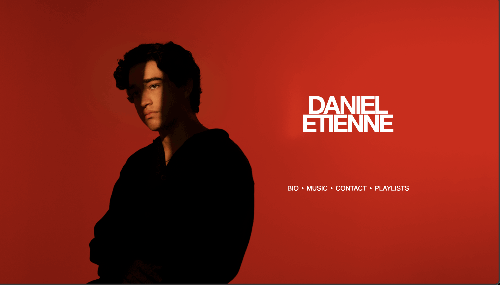
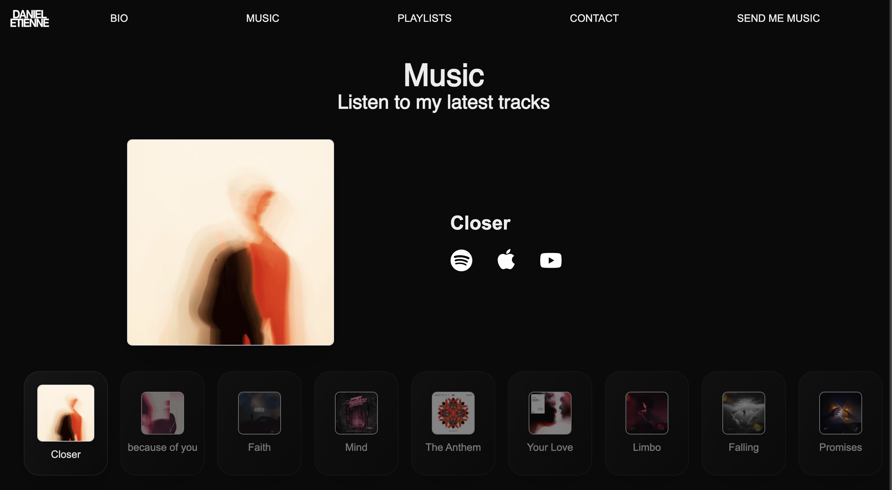
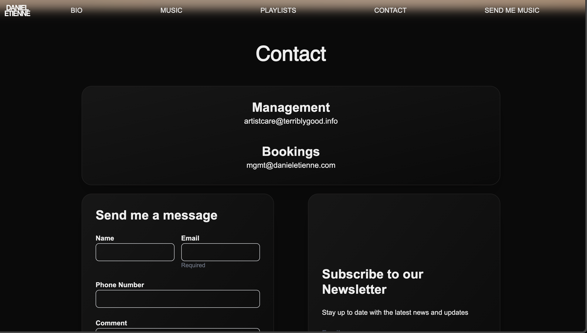
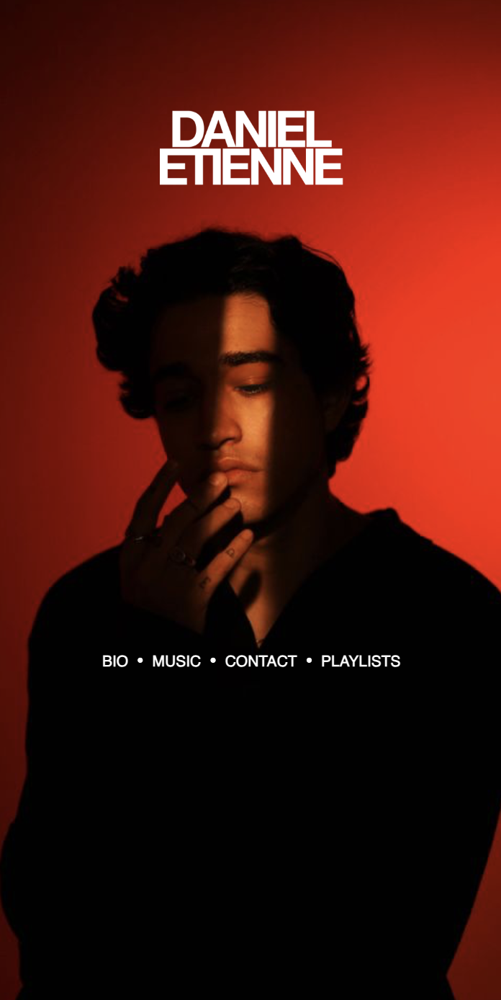

# 🌟 Etienne's Personal Website

A bold, minimalist, and fully responsive personal website for **Etienne** — designed to showcase his work, interests, and digital presence.

Built with performance and aesthetic in mind, this site serves as Etienne’s digital home, blending clean design with modern tech.

---

## 🌐 Live Site

[www.danieletienne.com](https://www.danieletienne.com/)

---

## 🚀 Tech Stack

- **Next.js 14** (App Router)
- **TypeScript**
- **Tailwind CSS**
- **Framer Motion** (for smooth transitions)
- **Vercel** (deployment)

---

## 📸 Screenshots

### 🏠 Homepage  


### 🎵 Music Player Section  


### 📨 Newsletter Signup  


### 📱 Mobile View  



---

## ⚙️ Local Setup

```bash
git clone https://github.com/yourusername/etienne.git
cd etienne
npm install
npm run dev